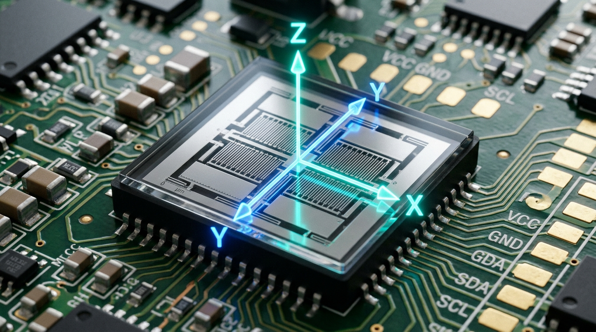
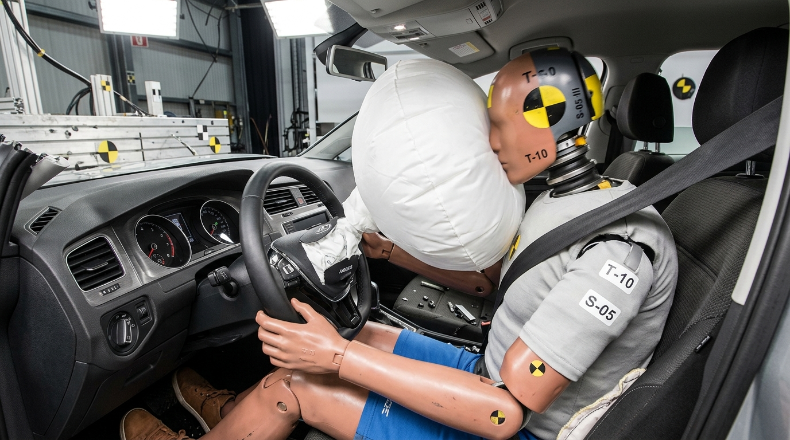

# BÀI 8: CHUYỂN ĐỘNG BIẾN ĐỔI. GIA TỐC (VẬT LÍ 10 - GDPT 2018)

Trong thực tế hàng ngày, các phương tiện giao thông như ô tô, xe máy, xe buýt hay máy bay hiếm khi chuyển động với vận tốc không đổi trong suốt hành trình. Phương tiện tăng tốc khi bắt đầu khởi hành, giảm tốc độ khi hãm phanh vào trạm dừng, hoặc đổi hướng chuyển động khi đi qua đoạn đường cong. Những chuyển động có vận tốc thay đổi theo thời gian như vậy đóng vai trò phổ biến trong đời sống và kỹ thuật. Đại lượng nào được sử dụng để xác định sự thay đổi nhanh hay chậm của vận tốc?

---

## 1. Chuyển động biến đổi trong thực tế

Chuyển động có vận tốc thay đổi theo thời gian được gọi là **chuyển động biến đổi**.

Vận tốc là một đại lượng vectơ gồm cả độ lớn (tốc độ) và hướng (phương, chiều). Do đó, sự biến đổi của vận tốc có thể xảy ra theo một trong ba trường hợp sau:
* **Chỉ thay đổi về độ lớn:** Vật chuyển động trên quỹ đạo thẳng nhưng tốc độ tăng dần (chuyển động nhanh dần) hoặc tốc độ giảm dần (chuyển động chậm dần). Ví dụ: Xe ô tô tăng tốc trên đường thẳng khi đèn tín hiệu giao thông chuyển sang màu xanh.
* **Chỉ thay đổi về hướng:** Vật chuyển động với độ lớn vận tốc không đổi nhưng phương chiều liên tục thay đổi theo quỹ đạo cong. Ví dụ: Xe máy đi qua khúc cua tròn với tốc độ kế giữ nguyên $40\text{ km/h}$.
* **Thay đổi đồng thời cả độ lớn và hướng:** Vận tốc vừa biến đổi về tốc độ vừa đổi phương chiều. Ví dụ: Chuyển động của quả bóng được sút bay bổng trong không gian.

---

## 2. Khái niệm và công thức tính gia tốc

### a) Định nghĩa gia tốc
Gia tốc là đại lượng vật lí đặc trưng cho sự thay đổi nhanh hay chậm của vận tốc theo thời gian.

### b) Công thức tính gia tốc trung bình
Giả sử tại thời điểm $t_1$ vật có vận tốc là $v_1$, đến thời điểm $t_2$ vật có vận tốc là $v_2$. Trong khoảng thời gian $\Delta t = t_2 - t_1$, độ biến thiên vận tốc của vật là $\Delta v = v_2 - v_1$.

Gia tốc trung bình của vật trong khoảng thời gian $\Delta t$ được xác định theo công thức:
$$a_{tb} = \frac{\Delta v}{\Delta t} = \frac{v_2 - v_1}{t_2 - t_1}$$

### c) Đơn vị của gia tốc trong hệ SI
* Đơn vị của gia tốc là mét trên giây bình phương, ký hiệu là $\mathbf{\text{m/s}^2}$ (hoặc $\text{m}\cdot\text{s}^{-2}$).
* **Ý nghĩa vật lí:** Gia tốc có giá trị bằng $a = 3\text{ m/s}^2$ cho biết trong mỗi khoảng thời gian 1 giây, vận tốc của vật biến đổi một lượng bằng $3\text{ m/s}$.

### d) Gia tốc tức thời
Khi xét khoảng thời gian $\Delta t$ vô cùng nhỏ tiến dần về 0 ($\Delta t \to 0$), đại lượng $\frac{\Delta v}{\Delta t}$ đặc trưng cho sự biến thiên vận tốc tại một thời điểm xác định và được gọi là **gia tốc tức thời**.

---

## 3. Vectơ gia tốc và mối quan hệ với vectơ vận tốc

Vì vận tốc là một đại lượng vectơ nên gia tốc cũng là một đại lượng vectơ:
$$\vec{a} = \frac{\Delta \vec{v}}{\Delta t} = \frac{\vec{v}_2 - \vec{v}_1}{t_2 - t_1}$$

Vectơ gia tốc $\vec{a}$ có các đặc điểm hình học:
* **Gốc:** Đặt tại vật chuyển động.
* **Hướng:** Trùng với hướng của vectơ độ biến thiên vận tốc $\Delta \vec{v} = \vec{v}_2 - \vec{v}_1$.
* **Độ lớn:** $a = \frac{|\Delta v|}{\Delta t}$.

### Quy tắc xác định dấu và hướng trong chuyển động thẳng:
* **Chuyển động thẳng nhanh dần:** Vectơ gia tốc cùng hướng với vectơ vận tốc ($\vec{a} \uparrow\uparrow \vec{v}$). Khi chọn chiều dương là chiều chuyển động thì $a$ và $v$ cùng dấu $\Rightarrow \mathbf{a \cdot v > 0}$.
* **Chuyển động thẳng chậm dần:** Vectơ gia tốc ngược hướng với vectơ vận tốc ($\vec{a} \uparrow\downarrow \vec{v}$). Khi chọn chiều dương là chiều chuyển động thì $a$ và $v$ trái dấu $\Rightarrow \mathbf{a \cdot v < 0}$.
* **Chuyển động thẳng đều:** Vận tốc không đổi $\Rightarrow \vec{a} = \vec{0} \iff a = 0$.

> **Lưu ý:** Dấu của gia tốc $a$ (dương hay âm) phụ thuộc vào việc lựa chọn chiều dương của hệ quy chiếu. Do đó, gia tốc mang giá trị âm ($a < 0$) chưa đủ để khẳng định vật chuyển động chậm dần. Tính chất nhanh dần hay chậm dần phải được xác định thông qua dấu của tích số $a \cdot v$.

---

## 4. Đồ thị vận tốc – thời gian $(v - t)$ và ý nghĩa của độ dốc

Trên hệ trục tọa độ vuông góc $Ovt$ (trục tung biểu diễn vận tốc $v$, trục hoành biểu diễn thời gian $t$):
* **Hệ số góc (độ dốc)** của đoạn thẳng trên đồ thị $v - t$ chính là giá trị của gia tốc $a$:
$$\text{Độ dốc} = \tan\theta = \frac{\Delta v}{\Delta t} = a$$

* **Ý nghĩa các dạng đường đồ thị:**
  - **Đường thẳng dốc lên:** Gia tốc có giá trị dương ($a > 0$), vận tốc tăng dần theo thời gian.
  - **Đường thẳng dốc xuống:** Gia tốc có giá trị âm ($a < 0$), vận tốc giảm dần theo thời gian.
  - **Đường thẳng nằm ngang:** Độ dốc bằng 0 ($a = 0$), vận tốc không đổi (chuyển động thẳng đều).

---

## 5. Ứng dụng thực tiễn của gia tốc trong kỹ thuật và đời sống

### a) Cảm biến gia tốc kế MEMS trong thiết bị thông minh
Trong điện thoại thông minh và đồng hồ thông minh, chip gia tốc kế vi cơ điện tử MEMS (Micro-Electro-Mechanical Systems) có kích thước chỉ vài milimet liên tục đo gia tốc quán tính theo 3 trục không gian ($X, Y, Z$). Ứng dụng để:
* Tự động nhận diện hướng cầm và xoay ngang/dọc màn hình hiển thị.
* Đếm chính xác số bước chân và tính toán mức tiêu hao năng lượng calo của người dùng.
* Kích hoạt hệ thống chống rung quang học (OIS) khi quay phim, chụp ảnh.
* Nhận diện tình huống rơi tự do để khóa đầu đọc bảo vệ dữ liệu.


*Hình 8.3: Cấu tạo vi cơ điện tử của chip cảm biến gia tốc kế MEMS 3 trục trong điện thoại thông minh (Đồ họa 3D thực tế)*

```
       [ Cấu trúc MEMS 3 trục ]
              +Y
               ^
               |  (Khối quán tính M)
          <----+----> +X
              /
             v
            +Z
```

### b) Hệ thống an toàn túi khí ô tô
Khi ô tô xảy ra va chạm mạnh, xe bị hãm phanh với gia tốc ngược chiều cực lớn ($|a| \ge 100\text{ m/s}^2$). Cảm biến va chạm (Crash Sensor) lập tức phát tín hiệu điện kích nổ túi khí màu trắng bung phồng căng từ vô lăng chỉ trong khoảng $20\text{ - }30\text{ ms}$, đóng vai trò tấm đệm êm hấp thụ xung lực và giảm chấn thương vùng đầu cho người lái.


*Hình 8.4: Túi khí an toàn màu trắng phồng căng từ vô lăng khi cảm biến phát hiện gia tốc hãm va chạm cực lớn (Đồ họa 3D thực tế)*

```
       [ Cảm biến va chạm ] ----> [ Xung điện kích nổ (20ms) ] ----> [ Túi khí bung từ vô lăng ]
         (Phát hiện a < 0 cực đại)                                     (Bảo vệ đầu và ngực)
```

### c) Hàng không vũ trụ & Huấn luyện gia tốc lớn (G-Force)
* **Huấn luyện phi công & phi hành gia:** Sử dụng máy ly tâm quay tốc độ cao để tạo gia tốc hướng tâm lớn ($G\text{-force} = 5G \to 9G \approx 50 \to 90\text{ m/s}^2$) giúp cơ thể làm quen với hiện tượng dồn máu khi bay cơ động hoặc phóng tên lửa.
* **Hệ thống dẫn đường quán tính (INS):** Cụm gia tốc kế đo liên tục vectơ gia tốc $\vec{a}$ để máy tính tự động tích phân xác định vận tốc và vị trí máy bay, tên lửa trong không gian mà không phụ thuộc vào sóng định vị GPS.


*Hình 8.5: Buồng máy ly tâm huấn luyện phi công chịu gia tốc lớn ($G\text{-force}$) và dẫn đường quán tính trong hàng không vũ trụ (Đồ họa 3D thực tế)*

```
       [ Trục quay ] ========[ Cánh tay đòn ]======== [ Buồng lái phi công (Chịu gia tốc 9G) ]
```

### d) Phân tích hiệu suất thể thao thành tích cao
Trong môn chạy nước rút 100m, thiết bị cảm biến gia tốc không dây gắn trên cơ thể vận động viên đo lường chính xác gia tốc bứt phá khỏi bàn đạp xuất phát ($a \approx 4,5\text{ - }6,0\text{ m/s}^2$) và thời điểm đạt vận tốc cực đại ($v_{max} \approx 11\text{ - }12\text{ m/s}$) để huấn luyện viên phân tích, tối ưu hóa kỹ thuật đạp chân và tư thế nghiêng người.


*Hình 8.6: Cảm biến phân tích quá trình gia tốc bứt tốc giai đoạn xuất phát của vận động viên điền kinh 100m (Đồ họa 3D thực tế)*

```
       [ Bàn đạp xuất phát ] ----> [ Bứt tốc cực đại (a ≈ 5 m/s²) ] ----> [ Vận tốc tối đa v_max ]
```

---

## Ghi nhớ trọng tâm bài học

* **Chuyển động biến đổi:** Chuyển động có vận tốc thay đổi theo thời gian.
* **Gia tốc:** Đại lượng đặc trưng cho sự thay đổi nhanh hay chậm của vận tốc theo thời gian: $a_{tb} = \frac{\Delta v}{\Delta t}$. Đơn vị chuẩn trong hệ SI là $\text{m/s}^2$.
* **Vectơ gia tốc $\vec{a}$:**
  - Nhanh dần: $\vec{a} \uparrow\uparrow \vec{v} \iff a \cdot v > 0$.
  - Chậm dần: $\vec{a} \uparrow\downarrow \vec{v} \iff a \cdot v < 0$.
* **Đồ thị $v - t$:** Độ dốc của đường biểu diễn $v - t$ chính là gia tốc $a = \tan\theta$.
