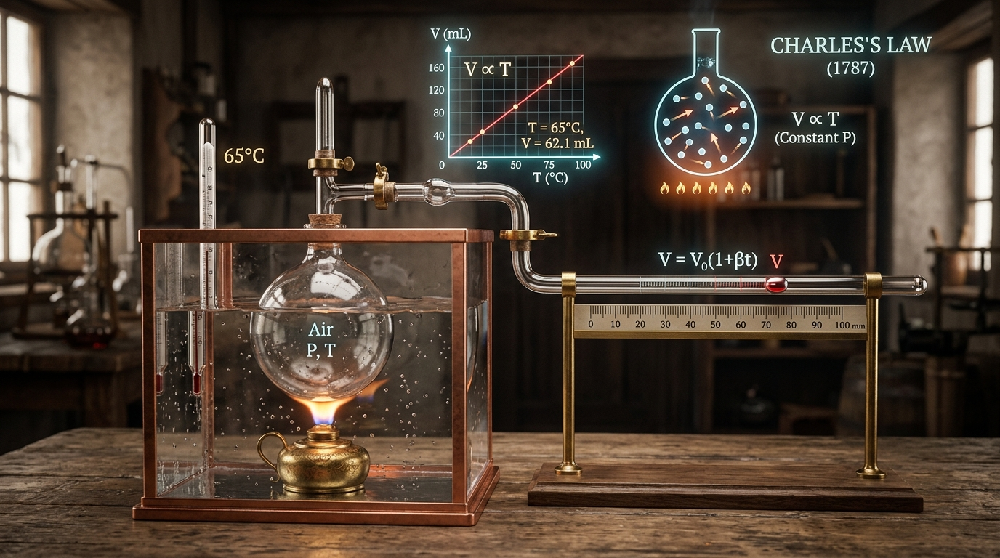
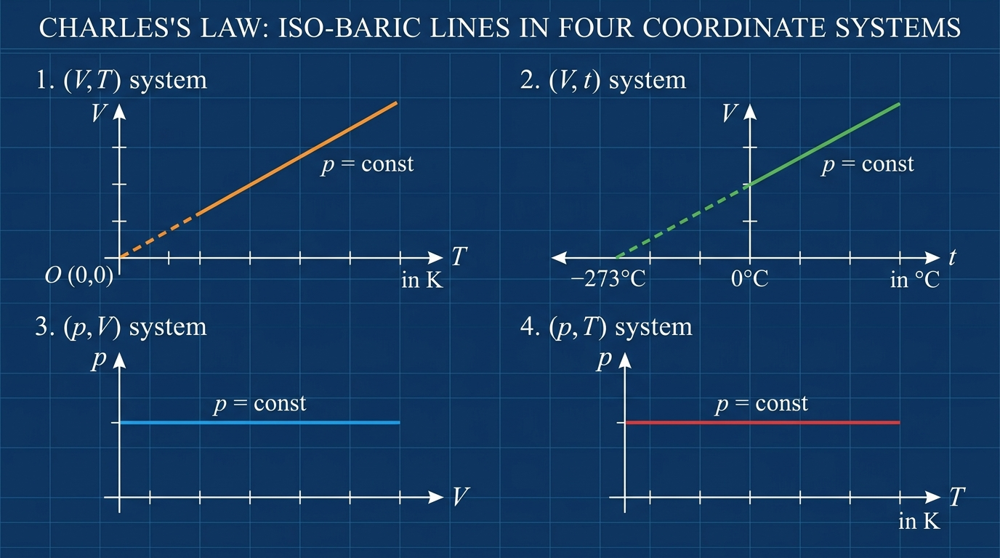

# BÀI 10: ĐỊNH LUẬT CHARLES - LÝ THUYẾT & THÍ NGHIỆM MÔ PHỎNG (VẬT LÍ 12 - GDPT 2018)

> **Môn học:** Vật lí 12 (Chương trình GDPT 2018)  
> **Chương II:** Chất khí - Bài 10  
> **Thẻ (Labels):** `Vật lí 12`, `Định luật Charles`, `Quá trình đẳng áp`, `Chất khí`

---

---

## 💡 LỜI GIỚI THIỆU

**Vì sao khi đun nóng không khí bên trong khinh khí cầu, nó lại có thể bay lên bầu trời?** Hay vì sao một quả bóng bay để ngoài trời nắng nóng lại nở to ra và dễ bị nổ?

Sự thay đổi thể tích của chất khí theo nhiệt độ khi giữ ở **áp suất không đổi** tuân theo **Định luật Charles** – một quy luật vật lí quan trọng được nhà bác học Jacques Charles tìm ra vào năm 1787. Bài viết tổng hợp đầy đủ lý thuyết cốt lõi, công thức tính toán, cách đọc đồ thị đường đẳng áp trong các hệ tọa độ và giải thích bản chất phân tử bám sát chương trình GDPT 2018.

---

## 📚 1. QUÁ TRÌNH ĐẲNG ÁP & THANG NHIỆT ĐỘ KELVIN

### 1.1. Khái niệm Quá trình đẳng áp
- **Quá trình đẳng áp** là quá trình biến đổi trạng thái của một lượng khí xác định khi **áp suất ($p$) được giữ không đổi**.
- **Điều kiện thực nghiệm:** Khối khí được chứa trong xi-lanh có piston di chuyển tự do không ma sát. Áp suất khí bên trong luôn cân bằng với áp suất khí quyển bên ngoài ($p = \text{const}$).

### 1.2. Thang nhiệt độ tuyệt đối Kelvin (K)
- Trong các định luật về chất khí, nhiệt độ phải luôn được tính theo **thang nhiệt độ tuyệt đối $T$ (Kelvin)**.
- **Công thức chuyển đổi giữa độ Celsius ($t$) và Kelvin ($T$):**
  $$T\text{ (K)} = t\text{ (}^\circ\text{C)} + 273$$
- **Độ không tuyệt đối ($0\text{ K} \approx -273^\circ\text{C}$):** Là nhiệt độ lý thuyết thấp nhất mà tại đó chuyển động nhiệt của các phân tử khí hoàn toàn ngừng lại.

---

## ⚖️ 2. ĐỊNH LUẬT CHARLES

### 2.1. Phát biểu định luật
> **Nội dung:** Với một lượng khí xác định ở áp suất không đổi, thể tích của khối khí tỉ lệ thuận với nhiệt độ tuyệt đối của nó.

*Hình 10.2: Thí nghiệm Jacques Charles (1787) – Thể tích V tỉ lệ thuận với nhiệt độ tuyệt đối T ở áp suất không đổi.*

### 2.2. Biểu thức toán học
$$V \propto T \quad \Longrightarrow \quad \frac{V}{T} = \text{const}$$

Khi khối khí biến đổi đẳng áp từ **trạng thái 1** ($V_1, T_1$) sang **trạng thái 2** ($V_2, T_2$):
$$\frac{V_1}{T_1} = \frac{V_2}{T_2} \quad \text{hay} \quad \frac{V_1}{V_2} = \frac{T_1}{T_2}$$

> **⚠️ Lưu ý quan trọng:**  
> - $V_1, V_2$ dùng cùng đơn vị thể tích ($\text{L}, \text{m}^3, \text{cm}^3...$).  
> - $T_1, T_2$ **BẮT BUỘC** đổi sang đơn vị Kelvin ($\text{K}$), tuyệt đối không dùng đơn vị $^\circ\text{C}$!

---

## 📈 3. ĐỒ THỊ ĐƯỜNG ĐẲNG ÁP TRONG CÁC HỆ TỌA ĐỘ

Đường biểu diễn sự biến thiên của thể tích theo nhiệt độ khi áp suất không đổi gọi là **đường đẳng áp**.

*Hình 10.3: Đồ thị đường đẳng áp trong các hệ tọa độ (V, T), (V, t), (p, V), (p, T).*

| Hệ tọa độ | Dạng đường đẳng áp | Đặc điểm đồ thị & Lưu ý |
| :--- | :--- | :--- |
| **Hệ $(V, T)$** | Đường thẳng có đường kéo dài đi qua gốc tọa độ $O(0\text{ K}, 0\text{ L})$ | Ở nhiệt độ cực thấp gần $0\text{ K}$, chất khí ngưng tụ thành lỏng/rắn nên định luật không còn đúng. Khi $p_2 > p_1$, đường $p_2$ nằm bên dưới đường $p_1$. |
| **Hệ $(V, t)$** | Đường thẳng kéo dài cắt trục nhiệt độ Celsius tại $-273^\circ\text{C}$ | Công thức liên hệ: $V = V_0(1 + \alpha t)$ với $\alpha = \frac{1}{273}\text{ K}^{-1}$. |
| **Hệ $(p, V)$** | Đường thẳng nằm ngang song song với trục thể tích $V$ | Áp suất $p$ giữ nguyên giá trị không đổi. |
| **Hệ $(p, T)$** | Đường thẳng nằm ngang song song với trục nhiệt độ $T$ | Áp suất $p$ giữ nguyên giá trị không đổi. |

---

## 🔬 4. GIẢI THÍCH ĐỊNH LUẬT BẰNG THUYẾT ĐỘNG HỌC PHÂN TỬ

- Khi đun nóng khối khí ở áp suất không đổi:
  1. Nhiệt độ $T$ tăng $\rightarrow$ Động năng trung bình và **tốc độ chuyển động của các phân tử khí tăng lên**.
  2. Phân tử va chạm vào thành bình **mạnh hơn và nhiều hơn**.
  3. Để giữ áp suất $p$ không đổi (không bị tăng vọt), khối khí buộc phải **nở ra** làm thể tích $V$ tăng lên.
  4. Thể tích tăng làm **mật độ phân tử giảm xuống**, từ đó giữ cho lực va chạm trung bình lên một đơn vị diện tích thành bình không đổi.

---

## 🎈 5. ỨNG DỤNG THỰC TẾ

1. **Khinh khí cầu:** Khi đốt nóng không khí bên trong khinh khí cầu, không khí nở ra (thể tích $V$ tăng), mật độ phân tử giảm làm khối lượng riêng nhỏ hơn không khí lạnh bên ngoài. Lực đẩy Archimedes đưa khinh khí cầu bay lên.
2. **Lốp xe mùa hè:** Không khí bên trong lốp xe bị nóng lên bởi mặt đường, thể tích có xu hướng tăng làm căng lốp và dễ gây nổ nếu bơm quá căng.
3. **An toàn bình xịt:** Các lon sơn xịt, bình gas mini để gần nguồn nhiệt sẽ làm khí bên trong giãn nở mạnh, gây tăng áp suất ép lên vỏ bình và dễ dẫn đến cháy nổ.

---

## 🧪 6. THÍ NGHIỆM KIỂM CHỨNG TRỰC TUYẾN

Trải nghiệm **Thí nghiệm kiểm chứng Định luật Charles** ngay tại website Vatli102.com:

- 🎮 **Mô phỏng thí nghiệm kiểm chứng:** Điều chỉnh nhiệt độ $T$, quan sát piston tự động giãn nở, ghi số liệu đo đạc kiểm chứng tỉ số $V/T = \text{const}$ và đồ thị đẳng áp $V-T$ biểu diễn thời gian thực.
