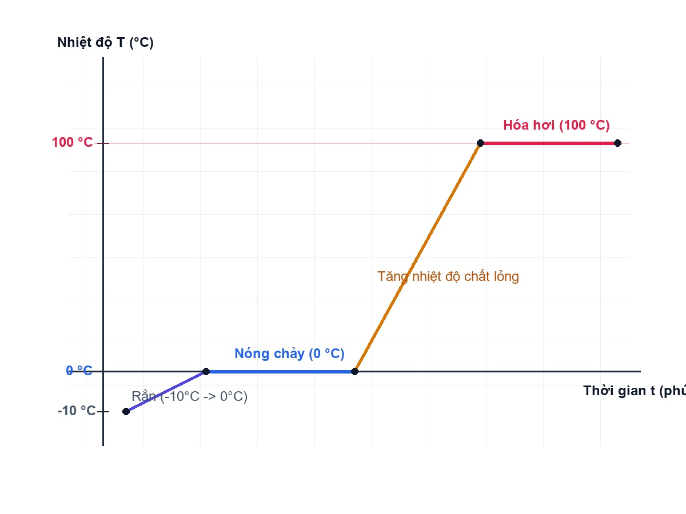
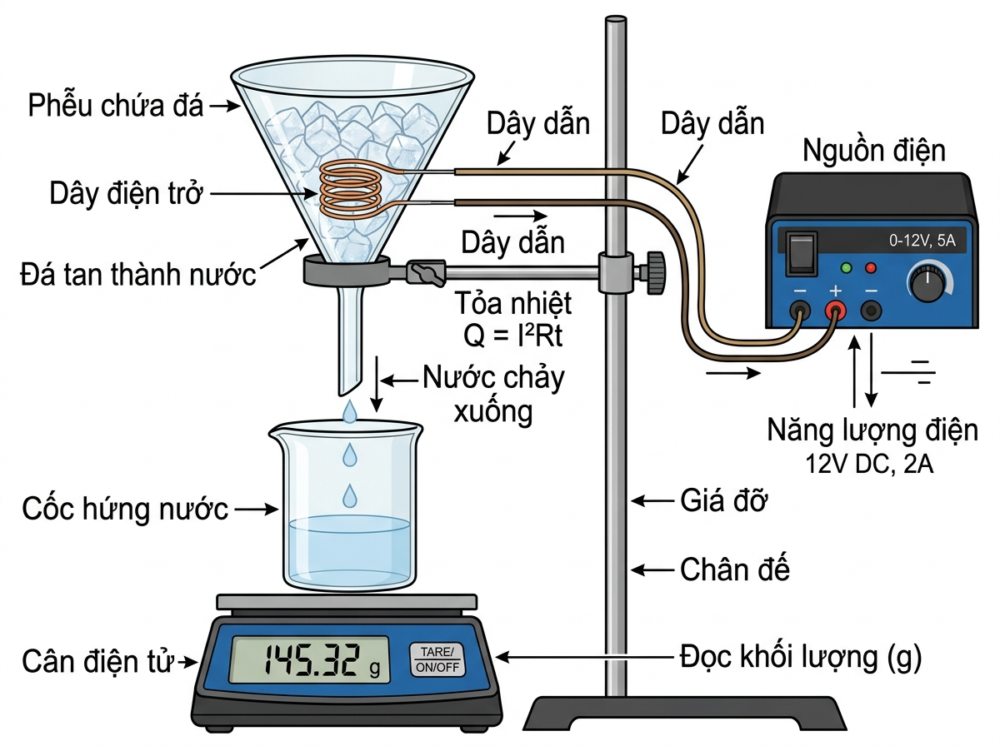
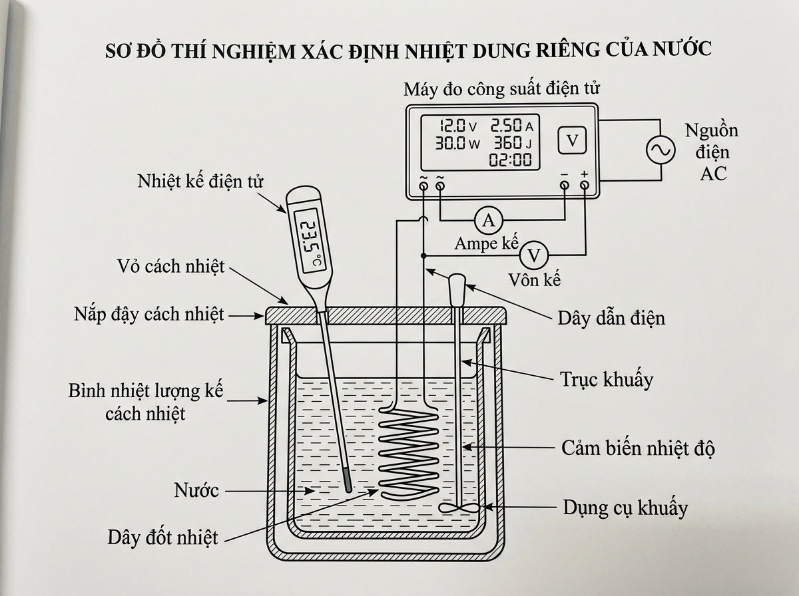

# 📝 PHIẾU BÀI TẬP: ÔN TẬP TỔNG HỢP CHƯƠNG 1 - VẬT LÍ 12 (ĐỀ SỐ 3)
**Chủ đề: Vật lí nhiệt | Cấu trúc: Phần I & II Suy luận lý thuyết - Phần III Bài tập tính toán**  
*Cấu trúc chuẩn Bộ GD&ĐT: Phần I (18 câu 4 lựa chọn) • Phần II (4 câu Đúng/Sai) • Phần III (6 câu trả lời ngắn)*

---

📋 **CHO BIẾT CÁC HẰNG SỐ VẬT LÍ BỔ TRỢ:**
* **Số Avogadro:** N_A ≈ 6,022.10²³ mol⁻¹
* **Hằng số khí lí tưởng:** R = 8,31 J/(mol.K) = 0,0821 L.atm/(mol.K)
* **Nhiệt dung riêng của nước:** c_nước = 4180 J/(kg.K) | **Nhiệt dung riêng của nước đá:** c_đá = 2090 J/(kg.K)
* **Nhiệt nóng chảy riêng của nước đá:** λ ≈ 3,34.10⁵ J/kg | **Nhiệt hóa hơi riêng của nước:** L ≈ 2,26.10⁶ J/kg
* *Lưu ý: Không làm tròn kết quả các phép tính trung gian.*

---

## 📌 PHẦN I. CÂU TRẮC NGHIỆM NHIỀU PHƯƠNG ÁN LỰA CHỌN (18 câu)
*(Mức độ: Suy luận lí thuyết từ nhận biết đến thông hiểu và vận dụng - Không có bài tập tính toán)*

**Câu 1.** Theo mô hình động học phân tử, phát biểu nào sau đây đúng khi nói về lực tương tác giữa các phân tử ở thể rắn?
A. Lực tương tác rất mạnh, giữ các phân tử ở vị trí cân bằng cố định.
B. Lực tương tác rất yếu, làm các phân tử chuyển động tự do hỗn loạn.
C. Lực tương tác bằng 0, các phân tử không tác dụng lực lên nhau.
D. Lực tương tác chỉ xuất hiện khi các phân tử ở xa nhau.

**Câu 2.** Mối liên hệ giữa độ biến thiên nhiệt độ ΔT trong thang Kelvin và độ biến thiên nhiệt độ Δt trong thang Celsius là
A. ΔT = Δt
B. ΔT = Δt + 273,15
C. ΔT = Δt - 273,15
D. ΔT = 273,15 - Δt

**Câu 3.** Phát biểu nào sau đây đúng về khái niệm nội năng của một hệ vật chất?
A. Nội năng là tổng động năng chuyển động nhiệt và thế năng tương tác của các phân tử cấu tạo nên hệ.
B. Nội năng là cơ năng chuyển động của toàn bộ hệ trong không gian.
C. Một vật đứng yên trên mặt đất thì nội năng của vật bằng 0.
D. Nội năng của một vật là đại lượng không thể biến đổi được.

**Câu 4.** Trong quá trình một chất rắn tinh khiết đang nóng chảy ở nhiệt độ nóng chảy xác định,
A. Nhiệt độ của chất không thay đổi dù tiếp tục cung cấp nhiệt lượng.
B. Nhiệt độ của chất tăng lên liên tục theo thời gian.
C. Động năng trung bình của các phân tử tăng lên nhanh chóng.
D. Chất rắn tỏa nhiệt lượng ra môi trường xung quanh.

**Câu 5.** Một nhóm học sinh tiến hành thí nghiệm đo nhiệt dung riêng của nước bằng bộ dụng cụ gồm: bình nhiệt lượng kế hai lớp vỏ có nắp đậy cách nhiệt, dây điện trở cấp nhiệt, oát kế đo công suất tiêu thụ điện P, biến thế nguồn và nhiệt kế điện tử. Trong quá trình thực hiện, nhóm ghi nhận nhiệt lượng do dây điện trở tỏa ra tính theo công thức Q = P.t lớn hơn nhiệt lượng mà lượng nước trong bình thực tế nhận được Q_thu = m.c.Δt. Nếu bỏ qua sự hấp thụ nhiệt của vỏ bình nhiệt lượng kế nhưng không thực hiện biện pháp hạn chế sự thất thoát nhiệt ra môi trường không khí xung quanh, giá trị nhiệt dung riêng c của nước tính được từ kết quả thực nghiệm sẽ:
A. Lớn hơn giá trị thực tế của nước do một phần nhiệt lượng bị thất thoát ra môi trường.
B. Nhỏ hơn giá trị thực tế của nước do nhiệt lượng nhận được lớn hơn.
C. Không thay đổi vì nhiệt dung riêng là hằng số của chất.
D. Luôn bằng 0 vì nhiệt lượng hao phí triệt tiêu hoàn toàn.

**Câu 6.** Theo quy ước dấu trong định luật I nhiệt động lực học ΔU = Q + A, khi một khối chất nhận nhiệt lượng từ bên ngoài và thực hiện công lên vật khác thì
A. Q > 0 và A < 0.
B. Q > 0 và A > 0.
C. Q < 0 và A < 0.
D. Q < 0 và A > 0.

**Câu 7.** Đồ thị hình bên biểu diễn quá trình đun nóng một mẫu nước đá từ -10 °C đến khi hóa hơi hoàn toàn. Đoạn đồ thị nằm ngang nằm đúng tại mức nhiệt độ 0 °C thể hiện quá trình nào?

A. Quá trình nóng chảy ở nhiệt độ cố định.
B. Quá trình tăng nhiệt độ chất lỏng.
C. Quá trình hóa hơi ở nhiệt độ sôi.
D. Quá trình tỏa nhiệt đông đặc.

**Câu 8.** Động năng trung bình của các phân tử cấu tạo nên vật tỉ lệ thuận với đại lượng nào sau đây?
A. Nhiệt độ tuyệt đối T của vật.
B. Thể tích V của vật.
C. Khối lượng m của vật.
D. Áp suất p của vật.

**Câu 9.** Ý nghĩa vật lí của nhiệt nóng chảy riêng λ của một chất rắn tinh khiết là
A. Nhiệt lượng cần cung cấp để 1 kg chất đó chuyển hoàn toàn từ thể rắn sang thể lỏng ở nhiệt độ nóng chảy.
B. Nhiệt lượng tỏa ra khi 1 kg chất đó tăng thêm 1 °C.
C. Nhiệt lượng cần thiết để 1 kg chất đó hóa hơi ở nhiệt độ sôi.
D. Tổng nội năng của 1 kg chất đó ở 0 °C.

**Câu 10.** Khi đun nóng một khối chất lỏng từ 20 °C đến 80 °C (chưa sôi), nội năng của khối chất lỏng tăng lên chủ yếu do
A. Động năng chuyển động nhiệt của các phân tử chất lỏng tăng lên.
B. Thế năng tương tác giữa các phân tử chất lỏng giảm mạnh.
C. Số lượng phân tử chất lỏng tăng lên.
D. Lực liên kết giữa các phân tử trở nên mạnh hơn.

**Câu 11.** Để đo nhiệt nóng chảy riêng của nước đá, một nhóm học sinh bố trí bộ dụng cụ thí nghiệm gồm: phễu thủy tinh chứa các viên đá vụn nhỏ ở 0 °C, dây điện trở cấp nhiệt đặt chìm trong khối đá, biến thế nguồn, oát kế đo công suất tỏa nhiệt P, cốc hứng nước bên dưới và cân điện tử (xem sơ đồ hình 2). Để loại bỏ ảnh hưởng của nhiệt lượng mà nước đá nhận từ môi trường không khí xung quanh, nhóm học sinh thực hiện thí nghiệm theo 2 giai đoạn: Giai đoạn 1 (chưa cắm điện trong thời gian t1) đo khối lượng nước đá tan chảy m1; Giai đoạn 2 (cắm điện trong thời gian t2 = t1) đo khối lượng nước đá tan chảy m2. Tác dụng chủ yếu của việc thực hiện thí nghiệm theo 2 giai đoạn này là:

A. Loại bỏ ảnh hưởng của nhiệt lượng mà nước đá nhận từ môi trường không khí xung quanh để xác định chính xác khối lượng đá tan do riêng dây điện trở tỏa ra m = m2 - m1.
B. Tăng tốc độ nóng chảy của nước đá trong phễu để rút ngắn thời gian làm thí nghiệm.
C. Đo trực tiếp công suất tỏa nhiệt thực tế của dây điện trở trong phễu.
D. Đảm bảo toàn bộ nước đá trong phễu tan chảy hoàn toàn thành nước.

**Câu 12.** Quá trình chuyển từ thể lỏng sang thể khí diễn ra ở bề mặt chất lỏng được gọi là
A. Sự bay hơi.
B. Sự sôi.
C. Sự ngưng tụ.
D. Sự nóng chảy.

**Câu 13.** Phát biểu nào sau đây đúng khi nói về sự sôi của chất lỏng?
A. Sự sôi là quá trình hóa hơi diễn ra đồng thời ở cả bề mặt và trong lòng khối chất lỏng tại nhiệt độ sôi xác định.
B. Sự sôi diễn ra ở mọi nhiệt độ của chất lỏng.
C. Trong quá trình sôi, nhiệt độ của chất lỏng tăng lên liên tục.
D. Sự sôi chỉ xảy ra trên bề mặt thoáng của chất lỏng.

**Câu 14.** Mùa hè khi lau sàn nhà bằng khăn ướt, ta cảm thấy không khí trong phòng mát hơn là do
A. Nước trên sàn nhà thu nhiệt năng từ không khí xung quanh để bay hơi.
B. Nước tỏa nhiệt lượng làm giảm nhiệt độ phòng.
C. Khăn ướt cản trở sự chuyển động của các phân tử không khí.
D. Nước làm tăng áp suất không khí trong phòng.

**Câu 15.** Trong hai cách làm thay đổi nội năng (thực hiện công và truyền nhiệt), điểm khác biệt cơ bản của cách thực hiện công là
A. Có sự chuyển hóa từ dạng năng lượng khác (như cơ năng) thành nội năng.
B. Không có sự chuyển hóa năng lượng giữa các dạng khác nhau.
C. Nhiệt độ của vật luôn bị giảm đi.
D. Không làm thay đổi động năng của các phân tử.

**Câu 16.** Ý nghĩa vật lí của nhiệt dung riêng c của một chất là
A. Nhiệt lượng cần cung cấp cho 1 kg chất đó để nhiệt độ của nó tăng thêm 1 K (hoặc 1 °C).
B. Nhiệt lượng tỏa ra khi 1 kg chất đó nóng chảy hoàn toàn.
C. Nhiệt lượng cần để 1 kg chất đó hóa hơi ở nhiệt độ sôi.
D. Nội năng của 1 kg chất đó ở nhiệt độ phòng.

**Câu 17.** Yếu tố nào sau đây KHÔNG làm tăng tốc độ bay hơi của chất lỏng?
A. Giảm diện tích mặt thoáng của chất lỏng.
B. Tăng nhiệt độ của chất lỏng.
C. Tăng tốc độ gió trên mặt thoáng.
D. Giảm độ ẩm tương đối của không khí xung quanh.

**Câu 18.** Khi hai vật có nhiệt độ khác nhau tiếp xúc nhiệt với nhau, quá trình truyền nhiệt dừng lại khi
A. Nhiệt độ của hai vật bằng nhau (đạt trạng thái cân bằng nhiệt).
B. Nhiệt dung riêng của hai vật bằng nhau.
C. Nội năng của hai vật bằng nhau.
D. Khối lượng của hai vật bằng nhau.

---

## 📌 PHẦN II. CÂU TRẮC NGHIỆM ĐÚNG / SAI (4 câu)
*(Mức độ: Suy luận lí thuyết thí nghiệm & hiện tượng nhiệt - Không có bài tập tính toán)*

**Câu 1.** Một nhóm học sinh thực hiện thí nghiệm đo nhiệt nóng chảy riêng của nước đá bằng phễu chứa đá vụn, dây điện trở cấp nhiệt có công suất P = 40 W, cốc hứng và cân điện tử. Thí nghiệm thực hiện qua 2 giai đoạn: Giai đoạn 1 (Chưa cắm điện trong 300 s): nước đá tan chảy thu được m1 = 12,0 g. Giai đoạn 2 (Cắm điện trong 300 s): nước đá tan chảy thu được m2 = 48,0 g. Coi lượng nước đá tan chảy do nhận nhiệt lượng từ môi trường xung quanh trong những khoảng thời gian bằng nhau là như nhau.
a) Ở giai đoạn 1, khối lượng nước đá tan chảy thu được hoàn toàn do nhận nhiệt lượng từ môi trường xung quanh.
b) Khối lượng nước đá tan do riêng dây điện trở tỏa ra được tính bằng hiệu khối lượng m = m2 - m1.
c) Việc tiến hành thí nghiệm qua 2 giai đoạn nhằm mục đích loại bỏ ảnh hưởng của sự trao đổi nhiệt với môi trường đến kết quả đo.
d) Nếu không dùng phễu mà để nước đá trong bình kín thì nước đá sẽ không thu nhiệt từ môi trường.

**Câu 2.** Hình 1 là đồ thị biểu diễn sự thay đổi nhiệt độ T theo thời gian t của một khối nước đá ban đầu ở thể rắn (-10 °C) được đun nóng liên tục bằng nguồn nhiệt có công suất không đổi P.
a) Đoạn đồ thị nằm ngang ở mức 0 °C biểu diễn quá trình chuyển thể nóng chảy từ thể rắn sang thể lỏng.
b) Đoạn đồ thị nằm ngang ở mức 100 °C biểu diễn quá trình chuyển thể hóa hơi ở nhiệt độ sôi.
c) Trong suốt các giai đoạn chuyển thể nằm ngang, khối chất không hề hấp thụ thêm nhiệt lượng từ nguồn đun.
d) Độ dốc của đường biểu diễn ở thể lỏng nhỏ hơn ở thể rắn chứng tỏ nhiệt dung riêng của chất ở thể lỏng lớn hơn ở thể rắn.

**Câu 3.** Xét các quá trình biến đổi nội năng của hệ vật chất theo nguyên lý I nhiệt động lực học ΔU = Q + A:
a) Khi đun nóng một thanh kim loại, thanh kim loại nhận nhiệt lượng (Q > 0) nên nội năng của nó tăng lên.
b) Khi cọ xát hai miếng kim loại làm chúng nóng lên, nội năng của kim loại tăng lên là do thực hiện công (A > 0).
c) Nén một khối khí trong xilanh cách nhiệt (Q = 0), công A > 0 làm nội năng ΔU > 0 nên nhiệt độ khối khí tăng lên.
d) Trong quá trình một chất lỏng đang sôi, nhiệt lượng nhận được làm tăng động năng trung bình phân tử làm nhiệt độ tăng.

**Câu 4.** Một nhóm học sinh tiến hành thí nghiệm đo nhiệt dung riêng của nước dùng bộ dụng cụ gồm bình nhiệt lượng kế cách nhiệt 2 lớp, dây điện trở đun nóng, que khuấy, biến thế nguồn và nhiệt kế điện tử:

a) Công suất tỏa nhiệt của dây điện trở được xác định thông qua đo hiệu điện thế U và cường độ dòng điện I hoặc dùng oát kế.
b) Nhiệt lượng kế hai lớp vỏ có lớp cách nhiệt nhằm mục đích hạn chế tối đa sự truyền nhiệt thất thoát ra môi trường ngoài.
c) Bỏ qua sự khuấy đều nước trong bình khi đun sẽ giúp nhiệt độ nước phân bố đều hơn và tăng độ chính xác của thí nghiệm.
d) Nếu một phần nhiệt lượng tỏa ra bị thất thoát ra ngoài vỏ bình thì giá trị nhiệt dung riêng c đo được sẽ lớn hơn giá trị thực.

---

## 📌 PHẦN III. CÂU TRẮC NGHIỆM TRẢ LỜI NGẮN (6 câu)
*(Mức độ: Bài tập tính toán con số định lượng)*

**Câu 1.** Cung cấp nhiệt lượng Q = 15.200 J cho 0,8 kg một chất kim loại làm nhiệt độ tăng từ 20 °C lên 70 °C. Nhiệt dung riêng c của kim loại này là bao nhiêu J/(kg.K)? (Đáp số: 380)

**Câu 2.** Đun 0,5 kg nước ở 20 °C đến khi hóa hơi hoàn toàn ở 100 °C. Cho c_nước = 4180 J/(kg.K), L = 2,26.10⁶ J/kg. Tổng nhiệt lượng Q cần cung cấp là bao nhiêu megajun (MJ)? (Đáp số: 1.30)

**Câu 3.** Thí nghiệm đo nhiệt nóng chảy riêng của nước đá: Công suất dây điện trở P = 50 W, thời gian t = 300 s, khối lượng đá tan chảy do riêng dây điện trở tỏa nhiệt m = 0,044 kg. Giá trị nhiệt nóng chảy riêng λ tính từ thí nghiệm là bao nhiêu.10⁵ J/kg? (Đáp số: 3.41)

**Câu 4.** Dùng ấm điện công suất P = 1000 W đun 1,2 kg nước ở 25 °C lên 100 °C. Biết hiệu suất ấm đun H = 85 %. Cho c_nước = 4180 J/(kg.K). Thời gian t cần thiết để đun nước là bao nhiêu giây (s)? (Đáp số: 443)

**Câu 5.** Thực hiện công A = 180 J để nén một lượng chất trong xilanh, đồng thời khối chất tỏa ra môi trường nhiệt lượng Q = 75 J. Độ biến thiên nội năng ΔU của khối chất là bao nhiêu jun (J)? (Đáp số: 105)

**Câu 6.** Rót 0,2 kg nước ở 32 °C vào một ly chứa 0,1 kg nước đá ở 0 °C. Cho c_nước = 4180 J/(kg.K), λ = 3,34.10⁵ J/kg. Bỏ qua mất mát nhiệt. Khối lượng nước đá đã tan chảy thành nước là bao nhiêu kg? (Đáp số: 0.080)

---
## 🔑 ĐÁP ÁN VÀ HƯỚNG DẪN GIẢI CHI TIẾT

### PHẦN I (Trắc nghiệm suy luận lí thuyết)
1.A | 2.A | 3.A | 4.A | 5.A | 6.A | 7.A | 8.A | 9.A | 10.A | 11.A | 12.A | 13.A | 14.A | 15.A | 16.A | 17.A | 18.A

### PHẦN II (Trắc nghiệm đúng sai lí thuyết)
- Câu 1: a) Đúng | b) Đúng | c) Đúng | d) Sai
- Câu 2: a) Đúng | b) Đúng | c) Sai | d) Đúng
- Câu 3: a) Đúng | b) Đúng | c) Đúng | d) Sai
- Câu 4: a) Đúng | b) Đúng | c) Sai | d) Đúng

### PHẦN III (Bài tập tính toán)
- Câu 1: 380
- Câu 2: 1.30
- Câu 3: 3.41
- Câu 4: 443
- Câu 5: 105
- Câu 6: 0.080
